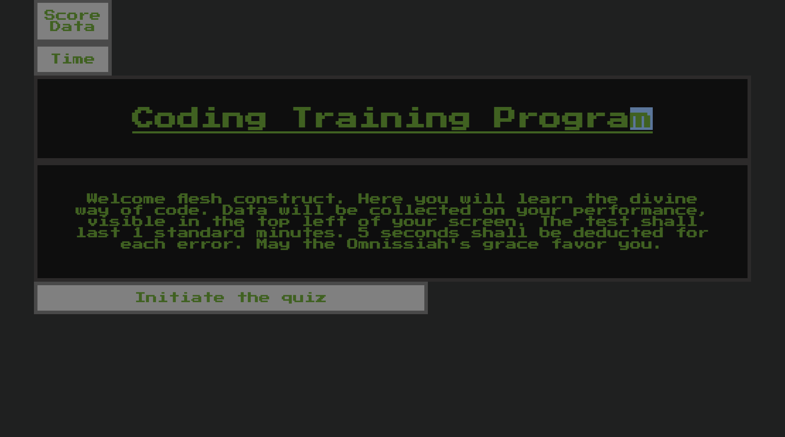
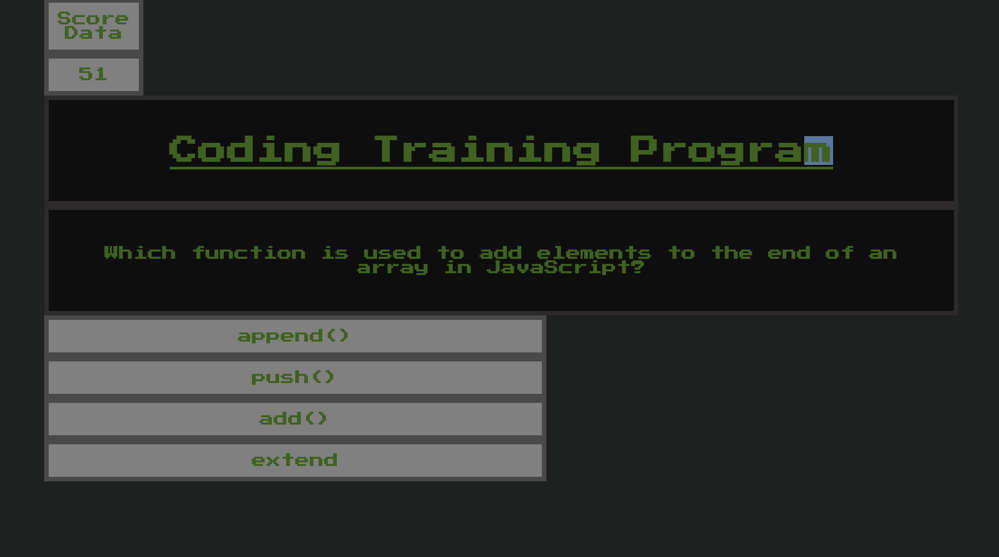

# Coding-Quiz-

Quiz of Coding Topics featuring multiple choice questions and high scores!

markdown --

- make list of things to do

-- interface, questions,
-- all content which gets switched needs own id
-- you can write all JS like runs only in terminal -- logic- create your funcitons

keep all JS-code orginized by topic ( scoreboard, buttons, changing questions)

- Jquery activity (for adding highscores)

# The Ad Mech Coding Quiz

Quiz website for those studying coding.

### Description

Multiple choice coding quiz done in a Ad Mech 40K theme. Quiz lasts for 60 seconds or until time runs out. Correct answers recieve points while incorrect answers result in a subtraction of remaining time. At the end of the quiz, name and score can be entered into interface which stores them in local storage. (When complete)
-- DOM manipulation
-- interating loops
-- timmer
-- JavaScript for element creation/ deletion
-- Hiding objects
-- Arrays with nested objects and arrays
-- Event listeners
-- CSS
-- Used github add, commits, and pushes to record changes

### To Do

-- add correct and incorrect answer reactions. (points and timmer subtraction)
-- add ability to enter name and highscore in local storage
-- Add delay of 1 second after click with color for correct and incorrect answers

**GitHub Repository Link**
https://github.com/Widewanderer/Coding-Quiz-

**Website**

### Screenshots

## 
